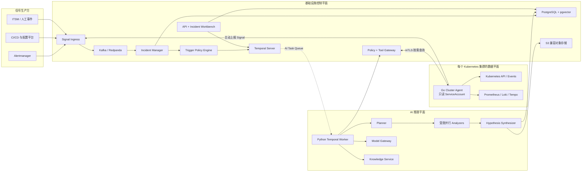
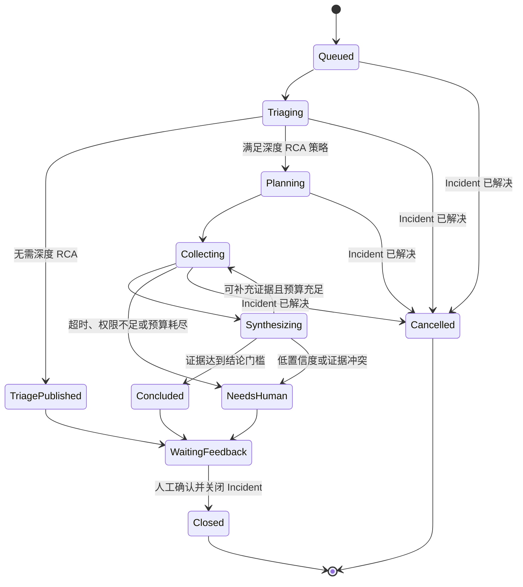

# 生产级 AIOps Agent 架构设计

> 版本：v1.0  
> 状态：架构基线  
> 日期：2026-07-26  
> 适用范围：企业私有化、单租户、多 Kubernetes 集群

## 1. 文档摘要

本方案设计一个以 Kubernetes 应用故障为首要场景的生产级 AIOps Agent。系统采用 **Incident 驱动、证据优先、工作流主导、默认只读** 的总体路线：确定性服务负责信号归一化、事件聚合、触发策略、权限、预算、工作流状态和审计；大模型只在受控范围内负责调查计划、证据选择、根因假设生成与修正。

首版聚焦以下四类故障：

1. 发布回归；
2. Pod 与 Workload 异常；
3. CPU、内存及其他资源瓶颈；
4. 服务依赖超时与错误传播。

首版只提供诊断、解释和修复建议，不直接执行生产写操作。未来自动修复由独立的 Remediation Executor 承担，AI 推理服务不获得写权限。

## 2. 目标与非目标

### 2.1 建设目标

- 从规范化、去重和聚合后的 Incident 启动调查，而不是让每条原始告警直接调用模型。
- 在 5 分钟内给出带证据引用的首次有效诊断。
- 输出排序后的根因假设、支持与反对证据、置信度、未知项和下一步验证动作。
- 在模型超时、Worker 重启、数据源失败或人工审批跨越较长时间时仍可恢复调查。
- 对所有模型调用、工具调用、策略判断和人工操作提供完整审计与回放能力。
- 支持企业私有化、单租户、多集群部署，并为未来多租户数据模型预留 `tenant_id`。
- 保证 AIOps Agent 故障不会阻断原有监控、告警和通知链路。

### 2.2 首版非目标

- 不建设面向任意问题的通用运维聊天机器人。
- 不一次覆盖物理机、网络设备、数据库自治、成本治理等全部 AIOps 领域。
- 不让模型直接执行 Shell、SSH、`kubectl exec` 或任意数据库语句。
- 不让 LLM 决定权限、维护窗口、预算、幂等或是否触发深度 RCA。
- 不承诺每个 Incident 都能得到确定根因；证据不足时必须允许返回“无法确定”。
- 不在首版开放自动生产修复。

## 3. 核心设计原则

1. **Incident-first**：Agent 消费 Incident，不直接消费未经处理的告警风暴。
2. **Evidence-first**：任何关键结论都必须引用可追溯证据。
3. **Workflow-first**：Temporal 管理可靠执行；LLM 只在有界 Activity 中推理。
4. **Read-only by default**：首版所有生产工具均为只读。
5. **Deterministic guardrails**：权限、预算、限流、触发和停止条件由确定性代码执行。
6. **Least privilege**：工具执行范围限制在当前 Incident、集群、命名空间和时间窗口内。
7. **Fail safely**：证据冲突、权限不足、预算耗尽或低置信度时升级给人，而不是编造结论。
8. **Replayable by design**：调查过程、版本和决策链必须可审计、可解释、可回放。
9. **Human-owned incidents**：P1/P2 的严重级别、根因确认与 Incident 关闭最终由值班人员负责。
10. **Independent alerting**：Agent 失效不影响原有告警通知。

## 4. 总体架构



### 4.1 平面划分

#### 基础设施控制平面

负责可靠、确定性且与模型无关的能力：

- Signal 接入与标准化；
- Incident 聚合和状态管理；
- 触发、限流、冷却和预算策略；
- Temporal Server；
- 身份、权限、Tool Gateway 和审计；
- API、Incident Workbench 与业务数据持久化。

#### AI 推理平面

负责受限的认知型工作：

- 构建调查计划；
- 选择类型化只读工具；
- 并行分析 Metrics、Logs、Traces、Kubernetes 和变更；
- 生成、更新和排除根因假设；
- 形成结构化诊断报告。

#### 集群数据平面

每个集群部署一个 Go Cluster Agent：

- 使用独立的只读 ServiceAccount；
- 主动向中心控制面建立 mTLS 连接；
- 不开放集群入站管理端口；
- 代理本地 Kubernetes 和观测系统查询；
- 不向模型暴露任何生产凭据；
- 不允许中心 Manager 直接 SSH 节点。

## 5. 核心组件职责

| 组件 | 主要职责 | 推荐语言/技术 |
|---|---|---|
| Signal Ingress | Webhook 鉴权、快速响应、标准化、限流、投递事件总线 | Go |
| Event Bus | Signal、Incident、变更及结果事件的持久化传递和回放 | Kafka/Redpanda |
| Incident Manager | 去重、聚合、抑制、关联、生命周期与稳定 Incident ID | Go |
| Trigger Policy Engine | 判断是否分诊、深度 RCA、冷却、停止或升级 | Go/策略引擎 |
| Temporal Server | 工作流状态、调度、超时、重试、Signal 和恢复 | Temporal |
| Python RCA Worker | Planner、Analyzer、Synthesizer 等 AI Activity | Python |
| Tool Gateway | 工具注册、授权、范围注入、脱敏、限额和审计 | Go |
| Cluster Agent | 集群内只读查询、事件上报、连接管理 | Go、client-go |
| Model Gateway | 模型认证、路由、限额、降级、审计和厂商解耦 | 独立服务 |
| Knowledge Service | Runbook、历史 Incident、架构文档的检索 | Python/PostgreSQL |
| Incident Workbench | 时间线、证据、假设、反馈与人工控制 | Web UI |
| Evaluation Service | 历史回放、Golden Dataset、回归和质量指标 | Python |

## 6. 端到端事件处理

### 6.1 Signal 接入

接入来源包括：

- Alertmanager Webhook；
- Kubernetes Event；
- Deployment、镜像、配置和 Feature Flag 变更；
- SLO burn-rate 事件；
- 人工创建或 ITSM 同步的事件。

Signal Ingress 必须：

1. 校验来源身份和签名；
2. 快速返回 2xx，不等待模型或后续调查；
3. 转换为统一 Signal Schema；
4. 写入持久化事件总线；
5. 对失败请求进行有限重试并进入 DLQ。

Webhook 是信号入口，不是 RCA 触发器。

### 6.2 Incident 归一化与聚合

Incident Manager 消费 Signal，并执行：

- 字段归一化；
- 基于资源、规则、标签和时间窗口的去重；
- 相关告警聚合；
- Silence、Inhibition 和维护窗口处理；
- 基于服务拓扑的上下游关联；
- 发布与配置变更关联；
- Incident 严重级别与影响面计算；
- `firing` 与 `resolved` 状态合并。

推荐幂等键：

```text
tenant_id / cluster_id / namespace / resource_uid / signal_type / rule_id
```

同一 Incident 的新增 Signal 更新 Incident 版本，并通过 Temporal Signal 通知已有 Workflow，避免重复启动调查。

### 6.3 触发策略

Trigger Policy Engine 在 Incident 形成后作出确定性判断。

快速分诊通常自动触发；深度 RCA 建议满足以下一项或多项：

- 严重级别为 P1/P2；
- 异常持续超过配置阈值；
- 影响对象或爆炸半径持续扩大；
- 与近期发布、配置或拓扑变化高度相关；
- 快速分诊无法解释异常；
- 值班人员主动请求。

硬停止条件包括：

- Incident 已解决或已存在同版本调查；
- 处于维护窗口或已静默；
- 达到租户、集群或模型预算；
- 处于冷却期；
- 调查并发达到上限；
- 数据源权限或合规策略禁止调查。

这些判断不能交给 LLM。

## 7. Temporal 工作流设计

### 7.1 Temporal 的架构位置

Temporal Server 位于基础设施控制平面。Worker 可以跨越两个平面：

- `investigation-ai` Task Queue：Python RCA Worker；
- `control-tools` Task Queue：Go 控制面 Activity；
- `notifications` Task Queue：结果通知与人工协作。

Temporal Server 不运行 LLM，也不直接查询观测系统。

### 7.2 Workflow 约束

- Workflow 代码必须保持确定性；
- 模型调用、数据库读写和工具查询全部封装为 Activity；
- Activity 必须设置超时、有限重试和幂等键；
- Temporal 负责可靠执行，但业务数据库仍是 Incident 和调查结果的事实源；
- Workflow ID 推荐为 `investigation/{incident_id}/{version}`；
- 支持 `IncidentUpdated`、`IncidentResolved`、`HumanFeedback` 和 `Cancel` 等 Signal。

### 7.3 调查状态机



### 7.4 Workflow 伪代码

```text
StartInvestigation(incident_id, version)
  context = LoadIncidentContext()
  triage = RunQuickTriage(context)

  if not EvaluateDeepRCAPolicy(context, triage):
      PublishTriageResult(triage)
      WaitForFeedbackOrClose()
      return

  plan = BuildInvestigationPlan(context, triage)

  while budget.available and round < max_rounds:
      evidence = RunAnalyzersInParallel(plan)
      hypotheses = SynthesizeHypotheses(context, evidence)

      if hypotheses.has_supported_conclusion:
          PublishDiagnosis(hypotheses)
          WaitForFeedbackOrClose()
          return

      if not hypotheses.has_actionable_next_query:
          break

      plan = BuildSupplementalPlan(hypotheses)

  EscalateToHuman(reason="insufficient_evidence_or_budget_exhausted")
```

## 8. Agent 推理拓扑

首版采用 **单一调查协调器 + 多个受限分析器**，不采用多个 Agent 自由聊天。

### 8.1 Planner

输入：Incident、快速分诊结果、服务拓扑、工具目录和预算。  
输出：结构化 `InvestigationPlan`。

Planner 只能从允许的 Analyzer 和工具集合中选择，不得动态创建工具、改变权限或修改预算。

### 8.2 Analyzers

首版包含：

- Kubernetes Analyzer；
- Metrics Analyzer；
- Logs Analyzer；
- Traces Analyzer；
- Change Analyzer。

Analyzer 可以并行运行，但只通过结构化状态交换结果，不互相进行自由对话。

### 8.3 Hypothesis Synthesizer

Synthesizer 负责：

- 生成 Top-N 根因假设；
- 将每个假设绑定到支持和反对证据；
- 识别证据冲突；
- 标注缺失信息；
- 降权或排除不成立假设；
- 在无法确认时明确输出不确定结果。

### 8.4 有界执行

每次调查必须配置：

- 最大总时长；
- 最大推理轮次；
- 最大模型 Token；
- 最大模型费用；
- 最大工具调用次数；
- 单次查询和总查询数据量；
- Analyzer 并发上限。

达到任一预算后停止自动调查并升级给人，禁止无限循环。

## 9. 类型化工具与 Tool Gateway

### 9.1 首版工具集合

```text
get_workload_state
get_kubernetes_events
query_metrics
search_logs
get_traces
list_recent_changes
inspect_dependencies
retrieve_runbook
```

### 9.2 Tool Gateway 职责

- 注入 `tenant_id`、集群、命名空间、资源 UID 和时间范围；
- 校验调用者、Incident 与目标资源之间的授权关系；
- 执行参数 Schema 校验；
- 限制查询时间跨度、返回行数和响应大小；
- 统一超时、重试、熔断和速率限制；
- 对 Secret、Token、个人信息和敏感字段脱敏；
- 记录请求、策略结果、执行耗时、结果摘要与证据引用；
- 将拒绝原因作为结构化结果返回，不允许模型通过改写指令绕过策略。

### 9.3 身份与权限计算

自动调查使用每个集群独立的只读服务身份。人工发起调查时，有效权限取以下三者交集：

```text
用户权限 ∩ Agent 服务权限 ∩ Incident 调查范围
```

模型永远不能接触 Kubernetes Token、数据库密码或观测系统凭据。

## 10. 数据模型

### 10.1 Signal

| 字段 | 说明 |
|---|---|
| `signal_id` | 全局唯一 Signal ID |
| `tenant_id` | 预留租户字段 |
| `cluster_id` | 集群标识 |
| `source` | Alertmanager、Kubernetes、CI/CD 等 |
| `signal_type` | 告警、变更、事件、恢复等 |
| `resource_ref` | 目标资源标识 |
| `severity` | 原始严重级别 |
| `starts_at` / `ends_at` | 时间范围 |
| `labels` | 标准化标签 |
| `payload_ref` | 原始载荷引用或哈希 |

### 10.2 Incident

| 字段 | 说明 |
|---|---|
| `incident_id` | 稳定 Incident ID |
| `version` | Incident 内容版本 |
| `grouping_key` | 聚合与幂等键 |
| `status` | Open、Acknowledged、Resolved、Closed |
| `severity` | 归一化严重级别 |
| `affected_resources` | 受影响资源集合 |
| `blast_radius` | 影响面摘要 |
| `topology_refs` | 相关服务拓扑引用 |
| `change_refs` | 相关变更引用 |
| `first_seen` / `last_seen` | 首次与最后时间 |

### 10.3 Investigation

| 字段 | 说明 |
|---|---|
| `investigation_id` | 调查 ID |
| `workflow_id` | Temporal Workflow ID |
| `incident_id` / `incident_version` | 对应 Incident 版本 |
| `phase` | Triage、Planning、Collecting、Synthesizing 等 |
| `budget` / `usage` | 时间、Token、费用和工具预算 |
| `model_version` | 模型与路由版本 |
| `prompt_version` | Prompt 版本 |
| `policy_version` | 策略版本 |
| `started_at` / `ended_at` | 调查时间 |

### 10.4 Evidence

| 字段 | 说明 |
|---|---|
| `evidence_id` | 证据 ID |
| `type` | Metric、Log、Trace、Kubernetes、Change、Knowledge |
| `source` | 实际数据源 |
| `query` | 经脱敏和归一化后的查询 |
| `time_range` | 证据时间范围 |
| `summary` | 供推理使用的受控摘要 |
| `raw_ref` | 原始数据引用 |
| `content_hash` | 防篡改哈希 |
| `freshness` | 数据新鲜度 |
| `redaction_status` | 脱敏结果 |

### 10.5 Hypothesis

| 字段 | 说明 |
|---|---|
| `hypothesis_id` | 假设 ID |
| `statement` | 根因陈述 |
| `component_ref` | 涉及组件 |
| `confidence` | 校准后的置信度 |
| `supporting_evidence_ids` | 支持证据 |
| `contradicting_evidence_ids` | 反对证据 |
| `missing_evidence` | 尚缺信息 |
| `status` | Proposed、Supported、Rejected、Unresolved |

### 10.6 DiagnosisResult

```json
{
  "incident_id": "inc-123",
  "status": "unresolved",
  "confirmed_facts": [],
  "hypotheses": [
    {
      "rank": 1,
      "statement": "新版本连接池配置导致依赖请求排队",
      "confidence": 0.68,
      "supporting_evidence_ids": ["ev-10", "ev-18"],
      "contradicting_evidence_ids": ["ev-21"]
    }
  ],
  "missing_information": ["新旧版本实例级连接池指标"],
  "next_actions": ["按版本维度查询连接池等待时间"],
  "remediation_proposal": null
}
```

## 11. 服务拓扑与变更情报

### 11.1 最小服务拓扑

首版不依赖完整 CMDB，而是动态合并：

- Kubernetes OwnerReference、Service、Ingress；
- Trace 中的真实调用关系；
- 服务目录中的负责人和业务归属；
- 发布、配置及基础设施关系。

每条拓扑边保存来源、最后观测时间和置信度。缺少拓扑时，Agent 必须缩小结论范围并降低置信度。

### 11.2 变更情报

变更属于一等证据，至少接入：

- 应用发布和镜像版本；
- ConfigMap、Secret 与 Feature Flag 变更；
- Kubernetes 资源变更；
- 数据库迁移；
- 云资源、网络策略和依赖配置变更。

时间相关不等于因果成立。Agent 仍需找到机制证据，例如错误率只在新版本实例上升。

## 12. 模型与知识策略

### 12.1 Model Gateway

Agent 不直接绑定模型厂商。Model Gateway 提供：

- 认证与密钥管理；
- 托管模型和本地模型路由；
- 按任务类型选择模型；
- 限额、重试、熔断和降级；
- Prompt、模型版本和费用审计；
- 敏感环境强制本地模型策略。

原始日志、指标和凭据留在企业环境。本地完成查询、聚合、裁剪和脱敏后，只发送完成诊断所需的最小证据。

### 12.2 RAG 边界

知识库可包含：

- Runbook；
- 架构文档；
- 服务目录；
- 已审核历史 Incident；
- Postmortem。

必须区分：

- **实时证据**：可支持或反驳当前根因；
- **参考知识**：只能生成调查假设和建议查询。

历史相似案例不能直接证明本次根因。知识条目需要携带版本、适用服务、适用环境和失效时间。

首版使用 PostgreSQL + `pgvector`，在规模和延迟证明有必要后再拆分专用向量数据库。

### 12.3 Python Agent 框架

首版使用模型 SDK + Pydantic 构建结构化 Activity，不引入第二套持久化状态机。

Temporal 是唯一持久工作流。若单个推理 Activity 内的分支复杂到普通代码难以维护，可以引入 LangGraph 作为内存级推理图，但不得让其 checkpoint 成为第二事实源。

## 13. 存储设计

| 数据 | 存储 |
|---|---|
| Incident、Investigation、Hypothesis、Evidence 元数据、审计和反馈 | PostgreSQL |
| Runbook 和历史事件向量 | PostgreSQL + pgvector |
| 冻结的证据快照和生成报告 | S3 兼容对象存储 |
| 原始 Metrics、Logs、Traces | Prometheus、Loki、Tempo 等原系统 |
| Workflow 执行状态 | Temporal 专用数据库/Schema |
| Signal 和领域事件 | Kafka/Redpanda |
| 短期限流和缓存 | Redis，可选 |

Temporal 数据库与业务数据库需要独立实例或至少独立 Schema。Redis 不承载不可丢失状态。

数据库写入和领域事件发布采用 Outbox Pattern，避免业务状态已提交但事件未发布。

## 14. 安全设计

### 14.1 身份与授权

- 用户通过企业 OIDC/SSO 登录；
- API 使用 RBAC/ABAC 控制集群、命名空间和数据源访问；
- Cluster Agent 使用独立机器身份和 mTLS；
- 自动调查使用每集群独立的只读 ServiceAccount；
- 凭据由 Vault/KMS 托管并自动轮换；
- AI Worker 和模型永远不直接接触生产凭据。

### 14.2 Prompt Injection 防护

日志、告警文本、Kubernetes 注解、工单和知识文档全部视为不可信输入：

- 工具结果作为数据进入模型，不作为系统指令；
- 忽略证据中要求调用工具、扩大权限或泄露信息的文本；
- 检索结果不能启用新工具或修改策略；
- 模型输出必须通过结构化 Schema 和策略校验；
- 对进入外部模型的内容进行脱敏和最小化。

### 14.3 审计

至少记录：

- Incident 和调查状态变更；
- 模型、Prompt、策略和工具版本；
- 工具参数、执行身份、目标范围和结果摘要；
- 假设新增、升降权和排除原因；
- 人工确认、修改和关闭动作；
- Token、延迟、查询量和费用；
- 权限拒绝和策略拒绝事件。

## 15. 可靠性与故障隔离

### 15.1 故障隔离原则

- 原有告警系统先独立通知值班人员，再异步投递 Signal；
- Signal 接入不等待模型；
- 事件总线使用至少一次投递；
- Incident ID、版本和 Activity 幂等键消除重复副作用；
- 模型、工具或数据源失败时允许降级为基础分诊；
- Worker 恢复后从 Temporal 检查点继续；
- AIOps 控制面完全不可用时，监控和告警仍正常工作。

### 15.2 可用性与灾备目标

- 控制面月可用性不低于 99.9%；
- 业务状态 RPO ≤ 5 分钟；
- 控制面 RTO ≤ 30 分钟；
- Manager、API、Temporal Worker 和 AI Worker 至少双副本跨节点部署；
- PostgreSQL、Temporal、事件总线和对象存储分别备份；
- 每季度执行实际恢复演练，而不是只检查备份任务状态。

## 16. Agent 自身可观测性

使用 OpenTelemetry 将以下链路串联为统一 Trace：

```text
Signal → Incident → Temporal Workflow → AI Activity
       → Tool Gateway → Cluster Agent → Data Source
```

核心指标包括：

- Signal 和 Incident 队列积压；
- Incident 到调查启动的延迟；
- 每个调查阶段的耗时、失败率和重试次数；
- 模型延迟、Token、费用、限流和降级比例；
- 工具错误率、查询量和数据源新鲜度；
- 低置信度、无结论和人工推翻比例；
- 各故障类型的 Top-1 / Top-3 命中率。

Agent 自身故障使用独立告警链路，不能让同一 Agent 成为其自身唯一诊断手段。

## 17. 产品与 API 设计

### 17.1 产品形态

采用 **Incident-first、Chat-second**：

- 主界面展示 Incident 状态、影响范围和时间线；
- 展示调查阶段、已调用工具及剩余预算；
- 展示 Top-N 假设、支持/反对证据和置信度；
- 提供变更、拓扑和原始数据跳转；
- 提供人工确认、纠错和关闭入口；
- 聊天仅作为当前 Incident 内的辅助交互，自动继承 Incident 范围和用户权限。

### 17.2 核心 API

```text
POST /v1/signals
GET  /v1/incidents/{incident_id}
POST /v1/incidents/{incident_id}/investigations
GET  /v1/investigations/{investigation_id}
POST /v1/investigations/{investigation_id}/cancel
GET  /v1/investigations/{investigation_id}/events
POST /v1/investigations/{investigation_id}/feedback
GET  /v1/evidence/{evidence_id}
```

启动调查接口必须支持 Idempotency-Key。调查时间线可通过 SSE 或 WebSocket 推送，但数据库中的业务状态仍为事实源。

## 18. 评测体系

### 18.1 首版质量门槛

- 关键结论证据引用率：100%；
- 无证据支撑的根因判断：低于 5%；
- Golden Dataset Top-3 根因召回率：不低于 70%；
- P95 首次有效诊断时间：低于 5 分钟；
- 未授权写操作：0；
- 达不到结论门槛时必须输出假设或“无法确定”。

### 18.2 Golden Dataset

每个关闭的 Incident 至少标注：

- 最终根因类别和影响组件；
- Agent Top-1 / Top-3 是否命中；
- 真正支持根因的证据；
- 遗漏的数据或错误调查分支；
- 是否缩短首次有效诊断时间；
- 修复建议是否安全、可执行。

生产反馈先进入审核队列，审核后才能成为 Golden Case 或知识库内容。不得让生产反馈自动修改 Prompt 或在线训练模型。

### 18.3 发布门禁

1. 历史事故离线回放；
2. 生产影子调查，结果仅供评测团队查看；
3. 建议模式，向值班人员展示但不自动确认；
4. 正式生产模式，自动触发并进入 Incident 时间线；
5. 未来对预批准低风险动作开放自动修复。

每次模型、Prompt、工具或策略升级，都必须重新通过离线回归和小流量 Canary。

## 19. 技术选型汇总

| 领域 | 首选方案 | 说明 |
|---|---|---|
| 控制面与集群 Agent | Go | Kubernetes 生态、并发、资源效率和部署稳定性 |
| AI 推理与评测 | Python | 模型 SDK、数据处理、RAG 和评测生态 |
| 持久化工作流 | Temporal | 超时、重试、Signal、恢复和人工等待 |
| Python 数据契约 | Pydantic | 强制结构化输出和运行时校验 |
| 事件总线 | Kafka/Redpanda | 持久化、回放和分区扩展 |
| 业务数据库 | PostgreSQL | Incident、调查、证据元数据和审计 |
| 向量检索 | pgvector | 首版避免额外专用向量基础设施 |
| 对象存储 | S3 兼容存储 | 证据快照和报告 |
| 观测标准 | OpenTelemetry | 跨 Go、Python、Temporal 和工具链路追踪 |
| 身份认证 | OIDC/SSO | 接入企业统一身份体系 |
| 凭据管理 | Vault/KMS | 动态凭据和自动轮换 |

## 20. 实施路线图

### 阶段 0：契约与评测基线

- 确定 Signal、Incident、Evidence、Hypothesis Schema；
- 建立故障分类体系；
- 整理历史 Incident 和 Golden Dataset；
- 定义首版 SLO、质量门槛和预算。

退出条件：核心数据契约冻结，历史回放数据可用。

### 阶段 1：Incident 基础设施

- Signal Ingress；
- PostgreSQL Outbox；
- Incident Manager；
- Alertmanager、Kubernetes Event 和 CI/CD 变更接入；
- 稳定 Incident ID、去重和聚合；
- 基础 Incident Workbench。

退出条件：告警风暴能够稳定收敛为可追踪 Incident。

### 阶段 2：快速分诊

- Temporal Server 与 Worker；
- Go Cluster Agent；
- Tool Gateway 和首批类型化工具；
- Python Quick Triage Worker；
- 发布回归、Pod 异常、资源瓶颈、依赖超时四类分诊。

退出条件：P95 首次分诊时间和基础证据引用达到要求。

### 阶段 3：深度 RCA 与影子运行

- Planner、五类 Analyzer 和 Synthesizer；
- 服务拓扑、变更情报和知识检索；
- 调查预算和停止条件；
- 历史回放和生产影子模式；
- 质量、成本与延迟评测。

退出条件：Golden Dataset Top-3 召回率和幻觉约束达到门槛。

### 阶段 4：受控生产

- 建议模式与人工反馈闭环；
- OIDC、RBAC/ABAC、凭据轮换与安全测试；
- HA、备份恢复和灾备演练；
- 小流量 Canary 后逐步扩大覆盖。

退出条件：达到生产 SLO，且未出现越权操作和告警链路耦合。

### 阶段 5：自动修复能力

仅在诊断能力稳定后建设独立 Remediation Executor：

- RCA Agent 只输出结构化 `RemediationProposal`；
- Executor 执行版本化、签名和预批准 Playbook；
- 支持审批、dry-run、幂等、超时、执行后验证和回滚；
- 高风险动作永远要求人工审批；
- Executor 使用与只读 Agent 完全隔离的身份和部署单元。

## 21. 主要风险与控制措施

| 风险 | 控制措施 |
|---|---|
| 告警风暴导致模型调用激增 | Incident 聚合、冷却、预算和并发限制 |
| 模型编造确定根因 | 证据引用、支持/反对证据、允许无结论 |
| Prompt Injection | 不可信数据隔离、类型化工具、策略网关和输出校验 |
| 跨集群或跨命名空间越权 | 双重身份约束、范围注入、mTLS 和审计 |
| Temporal 与业务状态不一致 | 业务数据库作为事实源、幂等 Activity、Outbox |
| 双重状态机复杂化 | Temporal 唯一持久工作流；LangGraph 仅限 Activity 内部 |
| 模型费用失控 | 快速分诊/深度 RCA 分级、Token 与工具预算 |
| 数据源故障造成错误结论 | 新鲜度标记、缺失证据降置信度、升级给人 |
| Agent 故障影响值班响应 | 告警链路完全解耦、异步投递和降级策略 |
| 自动修复扩大故障 | 首版只读；未来独立 Executor、审批和回滚 |

## 22. 生产验收清单

- [ ] 原告警通知不依赖 AIOps Agent。
- [ ] Signal 可持久化、重放并进入 DLQ。
- [ ] Incident 去重、聚合、版本和幂等测试通过。
- [ ] Temporal Workflow 可在 Worker 重启后恢复。
- [ ] 所有外部调用均在 Activity 中执行。
- [ ] LLM 无生产凭据，不能调用任意命令。
- [ ] Tool Gateway 完成范围注入、授权、脱敏和审计。
- [ ] 每个关键结论都有 Evidence ID。
- [ ] 系统能够返回“证据不足”。
- [ ] Prompt Injection 和越权测试通过。
- [ ] Golden Dataset 回归达到质量门槛。
- [ ] 影子运行和 Canary 门禁通过。
- [ ] PostgreSQL、Temporal 和事件总线完成恢复演练。
- [ ] 控制面异常不会影响监控与告警主链路。
- [ ] 首版部署不存在任何生产写权限。

## 23. 最终架构结论

生产级 AIOps Agent 的核心不是让大模型拥有更多自由度，而是把大模型放入一个可靠、可验证、可停止的调查系统中：

```text
Signal
  → Incident Manager
  → Deterministic Trigger Policy
  → Temporal Durable Workflow
  → Bounded Python RCA Activities
  → Typed Read-only Tools
  → Evidence-backed Diagnosis
  → Human Confirmation
```

该架构以 Go 承担 Kubernetes 与基础设施控制面，以 Python 承担 AI 推理与评测，以 Temporal 承担可靠工作流，以 PostgreSQL 和事件总线承担事实与事件持久化。首版优先证明诊断质量和生产安全，再逐步扩展覆盖范围与自动化能力。
